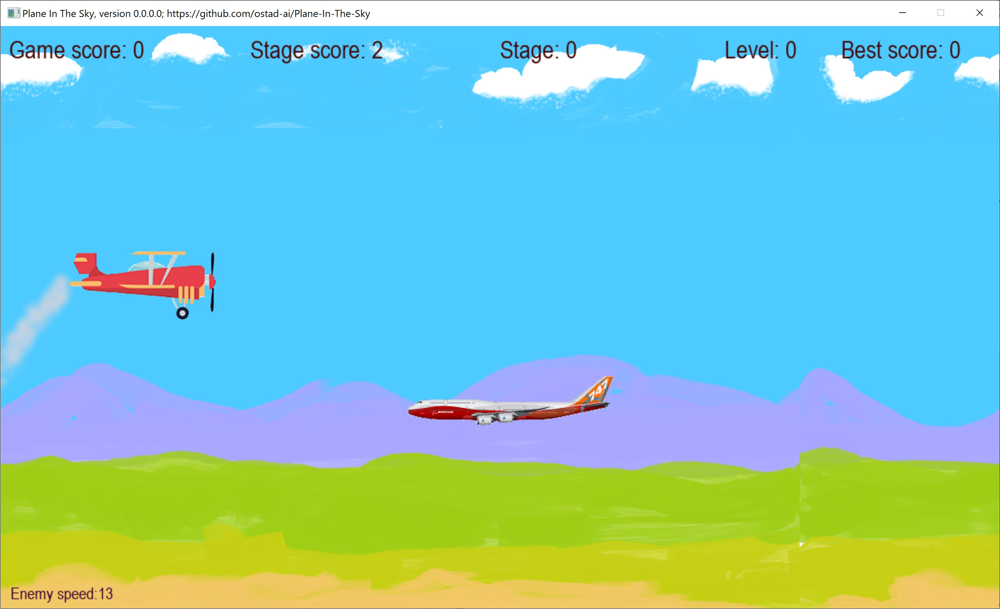

# PlaneInTheSky
### Newest: version 0.0.0.2
1. The plane now has missiles to launch to destroy enemies. The Space key is used to fire missiles.
2. You can pause and un-pause the game by pressing Pause key.
## This archive includes the executable program, planeinthesky.exe, which you should click on to run.
[Download the archive for win64](https://drive.google.com/file/d/1dF7bvhw6XID4-3NFL79r5c0xgUJLHi7H/view?usp=sharing)
### Earlier: version 0.0.0.1
1. Background now has buildings and trees, which are generated dynamically.
2. Movement of plane has become smoother.
### Earlier, version 0.0.0.0
1. A 2D plane crash game is released.
---
 *Figure 1: A snapshot of Plane-In-The-Sky while playing the game.*
---
 *Figure 2: A snapshot of Plane-In-The-Sky while playing the game with new background.*
---
 *Figure 3: A snapshot of Plane-In-The-Sky while firing missiles.*
---